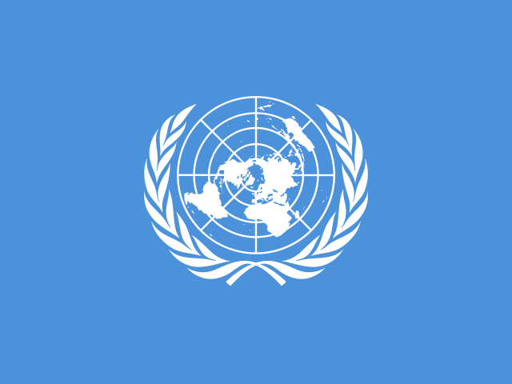

# Vue 3 Flag SVG

National and regional SVG flag icon components for Vue 3.x, including 266 flags.




## Installation

```bash
npm install vue3-flag-svg
```

## Usage

### Fully import

```js
//main.ts or main.js
import { createApp } from "vue";
import App from "./App.vue";
import Vue3FlagSVG from "vue3-flag-svg";

const app = createApp(App);

app.use(Vue3FlagSVG);
app.mount("#app");
```

### Manually import

```vue
<template>
  <ChinaFlag />
  <RussiaFlag />
  <UnitedStatesofAmericaFlag />
  <UnitedKingdomFlag />
  <FranceFlag />
</template>

<script setup>
import {
  UnitedStatesofAmericaFlag,
  ChinaFlag,
  RussiaFlag,
  UnitedKingdomFlag,
  FranceFlag,
} from "vue3-flag-svg";
</script>

<style>
/* 
  * the flag component only includes a  element
  * with default 100% width and auto height
  * customize it as you wish 
*/
</style>
```

## Generator Icons

This package is based on [flag-icons](https://www.npmjs.com/package/flag-icons).

If you want to clone the whole mono-repository and update flag svg assets, run:

```bash
# at monorepo root
npm install pnpm -D # if not installed

pnpm update flag-icons
pnpm run install-all
pnpm run build
```

To preview all icons, run:

```bash
pnpm run test
```
